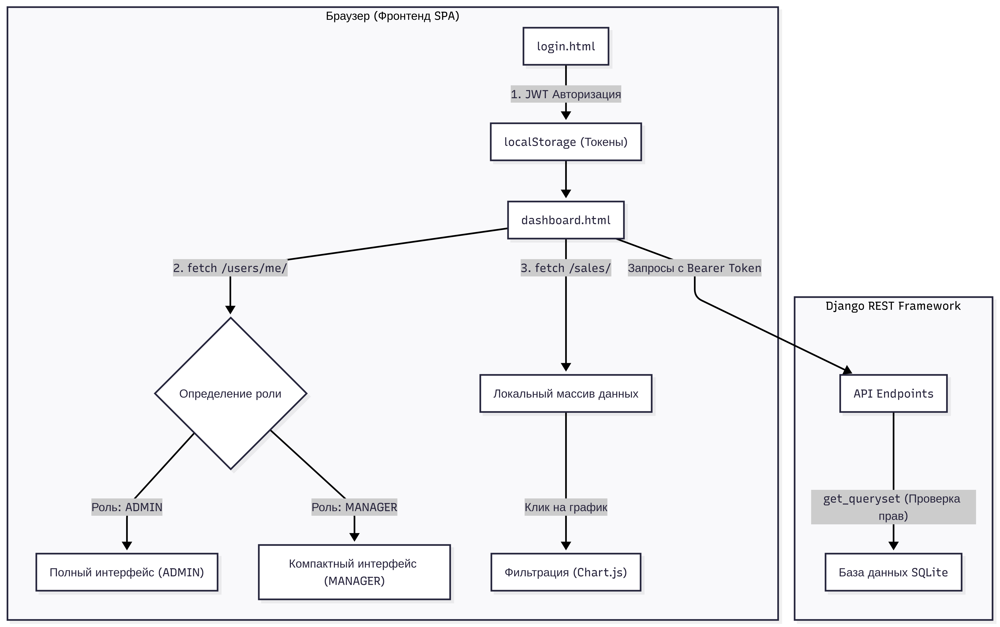

# 📊 Interactive Django Dashboard (JS Single Page App)

Интерактивная аналитическая панель продаж, разработанная в рамках курсового проекта. Проект представляет собой веб-приложение для мониторинга бизнес-показателей с динамическим разделением прав доступа (Администратор / Менеджер).

---

## 🗺️ Архитектура и логика работы приложения

Взаимодействие клиентской части (SPA на чистом JS) и серверной части (Django REST Framework) построено по следующей схеме:



### 🔑 Как работает логика авторизации и отображения:

1. **Авторизация**: Пользователь отправляет данные через `login.html` на эндпоинт `/api/v1/token/`. В ответ получает `access_token` и `refresh_token`, которые сохраняются в `localStorage`.

2. **Проверка роли**: При загрузке `dashboard.html` отправляется безопасный запрос на `/api/v1/sales/users/me/`. Бэкенд возвращает сериализованные данные текущего вошедшего пользователя (включая его роль и статус суперпользователя).

3. **Отрисовка UI**:
   * Если роль `ADMIN` — включается двухколоночный режим графиков, подгружается выпадающий список менеджеров для фильтрации, а в таблице операций появляется колонка "Менеджер".
   * Если роль `MANAGER` — график эффективности сотрудников ("Вклад менеджеров") скрывается, единственный график категорий центрируется, а колонка "Менеджер" в таблице скрывается для экономии места.

4. **Фильтрация на клиенте (100% стабильность)**: Приложение загружает весь массив данных один раз при входе. При клике на сектор диаграмм или при выборе сортировки JS мгновенно пересчитывает общие суммы на карточках и фильтрует таблицу прямо в памяти браузера, исключая лишний сетевой оверхед и ошибки баз данных.

---

## 📂 Структура проекта

* **`core/`** — Основное Django-приложение (бизнес-логика, модели, сериализаторы, вьюсеты).
* **`project/`** — Системные настройки Django-проекта, маршруты (URLs).
* **`dashboard.html`** — Одностраничный клиентский интерфейс панели аналитики.
* **`login.html`** — Страница авторизации пользователей.

---

## 🚀 Инструкция по установке и локальному запуску

### Шаг 1. Клонирование и настройка окружения

```bash
# Клонирование репозитория
git clone [https://github.com/ToxaTurtle/Interactive-Django-Dashboard.git](https://github.com/ToxaTurtle/Interactive-Django-Dashboard.git)
cd Interactive-Django-Dashboard

# Создание виртуального окружения
python -m venv venv
source venv/bin/activate  # Для Windows: venv\Scripts\activate

# Установка зависимостей
pip install -r requirements.txt

```

### Шаг 2. Миграции и создание данных

```bash
# Прогон базовых тестов
python manage.py test

# Применение миграций базы данных SQLite
python manage.py migrate

# Генерация демо-данных (3 менеджера, 6 категорий, 60 случайных продаж с разбросом дат и статусов)
python manage.py seed_data

# Создание суперпользователя (Администратора) для входа
python manage.py createsuperuser

```

### Шаг 3. Запуск сервера

```bash
python manage.py runserver

```

После этого API бэкенда будет доступно по адресу `http://127.0.0.1:8000/`.

Откройте файлы `login.html` и `dashboard.html` в браузере (можно использовать плагин Live Server в VS Code или просто запустить файл двойным кликом мыши).

---

## 🐳 Быстрый запуск с помощью Docker

Для максимального удобства развертывания проект полностью контейнеризирован. Вам не нужно устанавливать Python, Nginx или зависимости на свой компьютер — достаточно иметь установленный **Docker** и **Docker Compose**.

### Шаг 1. Сборка и запуск контейнеров

Выполните команду в корневой директории проекта:

```bash
docker compose up --build

(Либо используйте команду с sudo: sudo docker compose up --build)

```
### Шаг 2. Настройка базы данных и демо-данных

Так как локальная база данных по умолчанию не отслеживается Git, при первом запуске контейнера создастся чистая структура. Чтобы наполнить приложение данными для тестирования, не выключая докер, откройте новую вкладку терминала и выполните по очереди три команды:
Bash

```bash
# 1. Применение миграций базы данных внутри контейнера
docker compose exec backend python manage.py migrate

# 2. Генерация демо-данных (3 менеджера, 6 категорий, 60 случайных продаж)
docker compose exec backend python manage.py seed_data

# 3. Создание аккаунта Администратора (Суперпользователя)
docker compose exec backend python manage.py createsuperuser

```

### Шаг 3. Ссылки для работы с приложением
После запуска контейнеров сервисы будут доступны по следующим адресам:

    🖥️ Фронтенд (Интерфейс приложения): http://localhost:8080/login.html — основная точка входа, отсюда доступен весь интерактивный дэшбоард.

    ⚙️ Бэкенд API (Django REST Framework): http://localhost:8000/api/v1/ — служебный интерфейс эндпоинтов.

    📊 Панель администратора Django: http://localhost:8000/admin/ — управление пользователями и записями в БД через стандартную админку.

### 🛑 Остановка приложения
```Bash
# 1.  Чтобы поставить логи на паузу и остановить контейнеры, нажмите комбинацию клавиш Ctrl + C в окне терминала с запущенным Docker.
Ctrl + c
# 2. Чтобы полностью остановить проект и очистить временные Docker-сети (данные в БД при этом сохранятся), выполните команду:
docker compose down

```